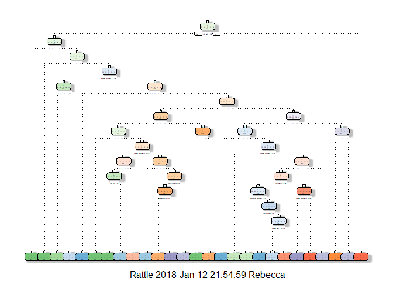
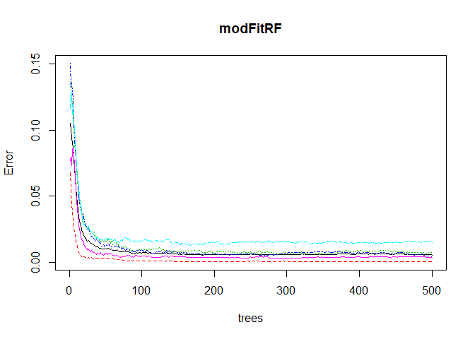

# Coursera - Machine Learning Final Project
Andrew Derbak  
January 11, 2018  
# Project Introduction
### Background
Using devices such as Jawbone Up, Nike FuelBand, and Fitbit it is now possible to collect a large amount of data about personal activity relatively inexpensively. These type of devices are part of the quantified self movement - a group of enthusiasts who take measurements about themselves regularly to improve their health, to find patterns in their behavior, or because they are tech geeks. One thing that people regularly do is quantify how much of a particular activity they do, but they rarely quantify how well they do it. In this project, your goal will be to use data from accelerometers on the belt, forearm, arm, and dumbell of 6 participants. They were asked to perform barbell lifts correctly and incorrectly in 5 different ways. More information is available from the website here: http://groupware.les.inf.puc-rio.br/har (see the section on the Weight Lifting Exercise Dataset).

### Data
The training data for this project are available here: https://d396qusza40orc.cloudfront.net/predmachlearn/pml-training.csv

The test data are available here: https://d396qusza40orc.cloudfront.net/predmachlearn/pml-testing.csv

The data for this project come from this source: http://groupware.les.inf.puc-rio.br/har. If you use the document you create for this class for any purpose please cite them as they have been very generous in allowing their data to be used for this kind of assignment.

### Goal
The goal of your project is to predict the manner in which they did the exercise. This is the "classe" variable in the training set. You may use any of the other variables to predict with. You should create a report describing how you built your model, how you used cross validation, what you think the expected out of sample error is, and why you made the choices you did. You will also use your prediction model to predict 20 different test cases.

# Preliminary Work

### Packages Needed
First, we will need to load the necessary packages.

```r
library(knitr)
```

```
## Warning: package 'knitr' was built under R version 3.4.2
```

```r
library(caret)
library(rpart)
library(rpart.plot)
library(rattle)
library(randomForest)
```

```
## Warning: package 'randomForest' was built under R version 3.4.3
```

```r
library(gbm)
```

```
## Warning: package 'gbm' was built under R version 3.4.3
```

```r
library(knitr)
```

Next, we will need to load the training and test data.


```r
trainUrl <- "http://d396qusza40orc.cloudfront.net/predmachlearn/pml-training.csv"
testUrl <- "http://d396qusza40orc.cloudfront.net/predmachlearn/pml-testing.csv"

trainingfile <- read.csv(url(trainUrl), na.strings=c("NA","#DIV/0!",""))
testingfile <- read.csv(url(testUrl), na.strings=c("NA","#DIV/0!",""))
```


# Data Cleaning

Before we can proceed, we need to clean the data of any issues. We will get rid of any columns that have missing values or are unhelpful for classification.


```r
trainingfile <- trainingfile[, colSums(is.na(trainingfile)) == 0]
testingfile <- testingfile[, colSums(is.na(testingfile)) == 0]

#Removing first 7 columns as these are identifiers that do not help us predict
trainingfile <- trainingfile[, -c(1:7)]
testingfile <- testingfile[, -c(1:7)]

#Seeing total dimensions of each file
dim(trainingfile);dim(testingfile)
```

```
## [1] 19622    53
```

```
## [1] 20 53
```

After getting rid of the missing and unhelpful values, we now end up with 53 variables to help us predict the exercise style.

# Data Splitting

From here, we can split the trainingfile into a training and testing set. Once we use create a strong model off of these sets, we will then apply this model to the testingfile.


```r
set.seed(213) #for reproducibility
inTrain <- createDataPartition(trainingfile$classe, p=0.6, list=FALSE)
training <- trainingfile[inTrain, ]
testing <- trainingfile[-inTrain, ]
```

# Data Modeling

### Decision Tree
We will start with a basic decision tree to see how accurate we can get.


```r
set.seed(111)
modFitDT <- rpart(classe ~ ., data=training, method="class")
fancyRpartPlot(modFitDT)
```

```
## Warning: labs do not fit even at cex 0.15, there may be some overplotting
```

<!-- -->

```r
predictdt <- predict(modFitDT, testing, type = "class")

confusionMatrix(predictdt, testing$classe)
```

```
## Confusion Matrix and Statistics
## 
##           Reference
## Prediction    A    B    C    D    E
##          A 2078  263   14  136   79
##          B   87 1037  207   68   74
##          C   10  116 1020  175   94
##          D   44   81   69  862  103
##          E   13   21   58   45 1092
## 
## Overall Statistics
##                                           
##                Accuracy : 0.7761          
##                  95% CI : (0.7667, 0.7852)
##     No Information Rate : 0.2845          
##     P-Value [Acc > NIR] : < 2.2e-16       
##                                           
##                   Kappa : 0.7151          
##  Mcnemar's Test P-Value : < 2.2e-16       
## 
## Statistics by Class:
## 
##                      Class: A Class: B Class: C Class: D Class: E
## Sensitivity            0.9310   0.6831   0.7456   0.6703   0.7573
## Specificity            0.9124   0.9311   0.9390   0.9547   0.9786
## Pos Pred Value         0.8086   0.7040   0.7208   0.7437   0.8885
## Neg Pred Value         0.9708   0.9245   0.9459   0.9366   0.9471
## Prevalence             0.2845   0.1935   0.1744   0.1639   0.1838
## Detection Rate         0.2648   0.1322   0.1300   0.1099   0.1392
## Detection Prevalence   0.3276   0.1877   0.1803   0.1477   0.1566
## Balanced Accuracy      0.9217   0.8071   0.8423   0.8125   0.8679
```

The prediction is a bit messy (a lot of values between different classes) and our overall accuracy is only 77.6%.

### Random Forest
Now, if we model using the Random Forest algorithm, it will automatically select the important variables and be more robust overall. 


```r
set.seed(222)
training$classe <- as.factor(training$classe)
modFitRF <- randomForest(classe ~ ., data=training)
plot(modFitRF)
```

<!-- -->

```r
predictrf <- predict(modFitRF, testing, type = "class")

confusionMatrix(predictrf, testing$classe)
```

```
## Confusion Matrix and Statistics
## 
##           Reference
## Prediction    A    B    C    D    E
##          A 2228    6    0    0    0
##          B    2 1509   11    0    0
##          C    2    3 1357   18    2
##          D    0    0    0 1266    3
##          E    0    0    0    2 1437
## 
## Overall Statistics
##                                           
##                Accuracy : 0.9938          
##                  95% CI : (0.9918, 0.9954)
##     No Information Rate : 0.2845          
##     P-Value [Acc > NIR] : < 2.2e-16       
##                                           
##                   Kappa : 0.9921          
##  Mcnemar's Test P-Value : NA              
## 
## Statistics by Class:
## 
##                      Class: A Class: B Class: C Class: D Class: E
## Sensitivity            0.9982   0.9941   0.9920   0.9844   0.9965
## Specificity            0.9989   0.9979   0.9961   0.9995   0.9997
## Pos Pred Value         0.9973   0.9915   0.9819   0.9976   0.9986
## Neg Pred Value         0.9993   0.9986   0.9983   0.9970   0.9992
## Prevalence             0.2845   0.1935   0.1744   0.1639   0.1838
## Detection Rate         0.2840   0.1923   0.1730   0.1614   0.1832
## Detection Prevalence   0.2847   0.1940   0.1761   0.1617   0.1834
## Balanced Accuracy      0.9986   0.9960   0.9940   0.9920   0.9981
```

# Conclusion

  We can see substantial improvement from the Decision Tree method to the Random Forest method. With Random Forest, we get 99% accuracy rate from our model, while the Decision Tree method only had a 77.6% accuracy rate. 
  
  Out of sample error rate is 0.62% for the Random Forest model.
  
  
# Quiz Results
  

```r
predictionRF <- predict(modFitRF, testingfile, type = 'class')
predictionRF
```

```
##  1  2  3  4  5  6  7  8  9 10 11 12 13 14 15 16 17 18 19 20 
##  B  A  B  A  A  E  D  B  A  A  B  C  B  A  E  E  A  B  B  B 
## Levels: A B C D E
```
